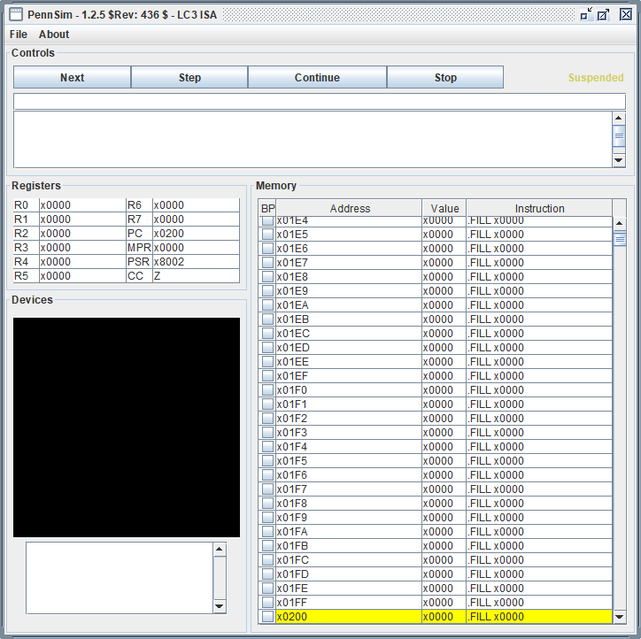

<!-- HEADER -->
<h4 align="center">Decompiled and rebuilt source code of the PennSim Simulator.</h4>

<!-- SHIELDS -->

  
  
  
  

<!-- LINKS -->

  <a href="#features">Features</a> •
  <a href="#how-to-use">How To Use</a> •
  <a href="#contributing">Contributing</a>

<!-- SCREENSHOT -->
<h4 align="center">
   
    
   
    Screenshot of PennSim running on Windows
   
</h4>

## Features

  * Added new commands to simplify common tasks
  * Multiple instruction sets (LC3, P37X)
  
## How To Use

  It is recommended that you import the project into an IDE such as IntelliJ and build it in there.

  Once you get the project running (or have acquired the [PennSim-x.x.x.jar](https://github.com/dadler64/PennSim/releases/)) give [A Gentle Guide to Using PennSim](https://github.com/dadler64/PennSim/wiki/A-Gentle-Guide-to-Using-PennSim) on the wiki a read to learn the basics of PennSim and the LC3 architecture.

## Contributing

  For now if you would like to contribute check out any currently open [issues](https://github.com/dadler64/PennSim/issues) which could be resolved.
